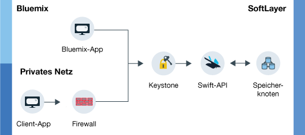

---

copyright:
  years: 2014, 2016

---

{:new_window: target="_blank"}

# Informationen zu {{site.data.keyword.objectstorageshort}}  {: #about-object-storage} 

*Letzte Aktualisierung: 19. Oktober 2016*
{: .last-updated}

{{site.data.keyword.objectstorageshort}} verwendet Metadaten zur Ermittlung von gespeicherten Objekten, sodass diese selbst bei großen Datenmengen gut durchsuchbar und schnell zugänglich sind.
{: shortdesc}

## Funktionsweise von {{site.data.keyword.Bluemix_notm}} Public {{site.data.keyword.objectstorageshort}}{: #public}

Public {{site.data.keyword.objectstorageshort}} verfügt über zwei getrennte Routen, denen ein Benutzer bei der Bereitstellung eines Kontos folgen kann. Sie können innerhalb Ihres privaten Netzes starten oder über eine {{site.data.keyword.Bluemix_notm}}-App auf {{site.data.keyword.objectstorageshort}} zugreifen. Sowohl Administratoren als auch Entwickler können Objekte speichern und darauf zugreifen, wie im folgenden Diagramm dargestellt.

<dl>
  <dt><dfn>Client-App</dfn></dt>
  <dd> Sie können in einem privaten Netz direkt über Ihre Anwendung durch eine Firewall auf {{site.data.keyword.objectstorageshort}} zugreifen.</dd>
  <dt><dfn> {{site.data.keyword.Bluemix_notm}}-App</dfn></dt>
  <dd> Sie können den {{site.data.keyword.objectstorageshort}}-Service an eine {{site.data.keyword.Bluemix_notm}}-App binden.</dd>
  <dt><dfn>Keystone</dfn></dt>
  <dd> Sie können die vom {{site.data.keyword.objectstorageshort}}-Service bereitgestellten Berechtigungsnachweise verwenden, um ein Berechtigungstoken von Keystone abzurufen.</dd>
  <dt><dfn>OpenStack Swift-API</dfn></dt>
  <dd> Nachdem Sie Ihre Instanz authentifiziert haben, haben Sie mittels der Swift-API Lese- und Schreibzugriff auf gespeicherte Objekte.</dd>
  <dt><dfn>Speicherknoten</dfn></dt>
  <dd> Der Service pflegt drei Kopien Ihrer Daten, die in <a href="http://docs.openstack.org/developer/swift/overview_replication.html">mehreren Speicherknoten repliziert werden</a>.</dd>
</dl>

*Abb. 1. Funktionsweise von {{site.data.keyword.Bluemix_notm}} Public {{site.data.keyword.objectstorageshort}}*

**Achtung**: Eine providerseitige Verschlüsselung wird nicht bereitgestellt. Für die Verschlüsselung von Daten vor dem Hochladen ist die Clientanwendung zuständig. Die Verschlüsselung auf Plattenebene steht derzeit für {{site.data.keyword.Bluemix_notm}} Public {{site.data.keyword.objectstorageshort}} nicht zur Verfügung.
