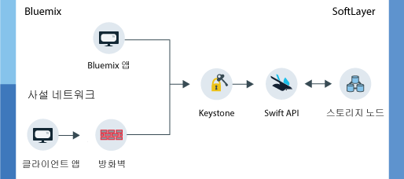

---

copyright:
  years: 2014, 2016

---

{:new_window: target="_blank"}

# {{site.data.keyword.objectstorageshort}} 정보  {: #about-object-storage} 

*마지막 업데이트 날짜: 2016년 10월 19일*
{: .last-updated}

{{site.data.keyword.objectstorageshort}}에서는 메타데이터를 사용하여 스토리지에 배치된 오브젝트를 식별하므로 대량의 데이터 중에서도 오브젝트를 쉽게 검색하고 오브젝트에 빨리 액세스할 수 있습니다.
{: shortdesc}

## {{site.data.keyword.Bluemix_notm}} Public {{site.data.keyword.objectstorageshort}} 작동 방식 {: #public}

Public {{site.data.keyword.objectstorageshort}}에는 계정을 프로비저닝할 때 사용자가 따라갈 수 있는 두 개의 개별 라우트가 있습니다. 사용자의 사설 네트워크에서 시작하거나 {{site.data.keyword.Bluemix_notm}} 앱을 통해 {{site.data.keyword.objectstorageshort}}에 액세스할 수 있습니다. 다음 다이어그램에 표시된 것처럼 관리자와 개발자 모두 오브젝트를 저장하고 오브젝트에 액세스할 수 있습니다. 

<dl>
  <dt><dfn> 클라이언트 앱 </dfn></dt>
  <dd> 사설 네트워크의 방화벽을 통과해 애플리케이션에서 직접 {{site.data.keyword.objectstorageshort}}에 액세스할 수 있습니다. </dd>
  <dt><dfn> {{site.data.keyword.Bluemix_notm}} 앱 </dfn></dt>
  <dd> {{site.data.keyword.objectstorageshort}} 서비스를 {{site.data.keyword.Bluemix_notm}} 앱에 바인드할 수 있습니다. </dd>
  <dt><dfn> Keystone </dfn></dt>
  <dd> {{site.data.keyword.objectstorageshort}} 서비스에서 제공되는 신임 정보를 사용하여 Keystone에서 인증 토큰을 얻을 수 있습니다. </dd>
  <dt><dfn> OpenStack Swift API</dfn></dt>
  <dd> 인스턴스를 인증하면 Swift API를 사용하여 저장된 오브젝트를 읽고 오브젝트에 쓸 수 있습니다. </dd>
  <dt><dfn> 스토리지 노드 </dfn></dt>
  <dd> 서비스는 <a href="http://docs.openstack.org/developer/swift/overview_replication.html">여러 스토리지 노드에 복제</a>되는 데이터의 세 사본을 유지보수합니다. </dd>
</dl>

*그림 1. {{site.data.keyword.Bluemix_notm}} Public {{site.data.keyword.objectstorageshort}} 작동 방식*

**주의**: 제공자 측 암호화는 제공되지 않습니다. 업로드 전에 클라이언트 애플리케이션에서 데이터를 암호화해야 합니다. 현재 {{site.data.keyword.Bluemix_notm}} Public {{site.data.keyword.objectstorageshort}}에 디스크 레벨 암호화를 사용할 수 없습니다. 
